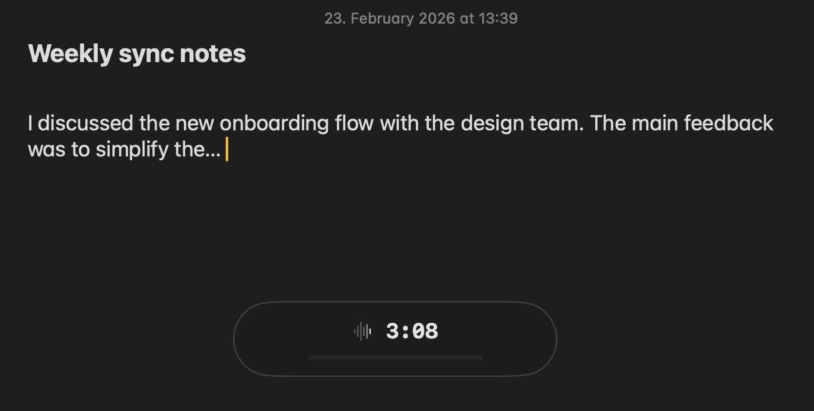
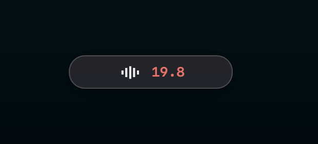
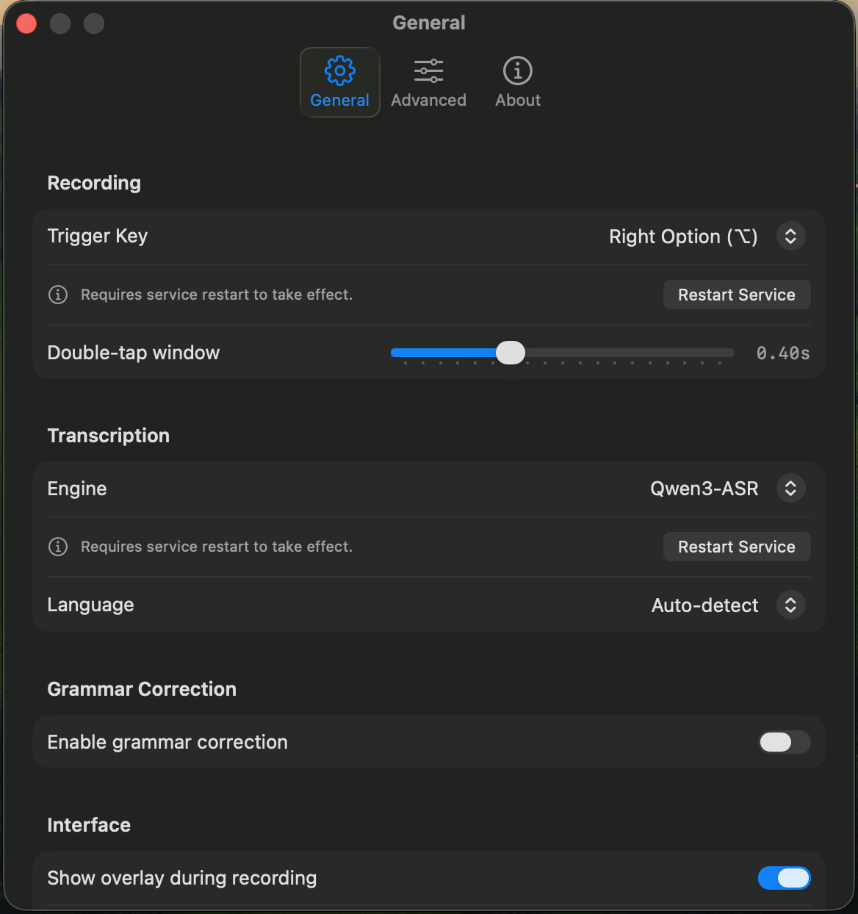

# Local Whisper

[](LICENSE)
[]()
[]()
[]()

**Local voice transcription, grammar correction, and text-to-speech for macOS.**

Double-tap a key, speak, tap to stop. Polished text lands in your clipboard. No cloud, no internet, no tracking. Transcription runs entirely on-device via Qwen3-ASR (MLX) by default.

<p align="center">
  
</p>

---

## Quick Start

**Apple Silicon required.** Microphone access and Accessibility permission required.

```bash
git clone https://github.com/gabrimatic/local-whisper.git
cd local-whisper
./setup.sh
```

`setup.sh` handles everything: Python venv, dependencies, Qwen3-ASR and Qwen3-TTS model downloads, Swift UI app build, LaunchAgent for auto-start, Accessibility permission, and the `wh` shell alias.

| Action | Key |
|--------|-----|
| Start recording | Double-tap **Right Option** |
| Stop and process | Tap **Right Option** or **Space** |
| Cancel | Tap **Esc** |
| Read selected text aloud | Press **⌥T** |
| Stop speech | Press **⌥T** again or **Esc** |

A floating overlay shows status during recording and speech.

---

## Grammar Backends

Pick a grammar correction engine (or skip grammar entirely):

| Backend | Requirements | Notes |
|---------|-------------|-------|
| **Apple Intelligence** | macOS 26+, Apple Silicon, Apple Intelligence enabled | Fastest, best quality |
| **Ollama** | [Ollama](https://ollama.com) installed and running | Works on any Mac |
| **LM Studio** | [LM Studio](https://lmstudio.ai) with model loaded + local server started | Works on any Mac |
| **Disabled** | (none) | Transcription only |

Switch backends from the **Grammar** submenu in the menu bar (instant, no restart), with `wh backend <name>` (restarts service), or in the Settings window.

<details>
<summary><strong>Ollama setup</strong> (optional)</summary>

1. Download from [ollama.com](https://ollama.com)
2. Pull a model and start the server:

```bash
ollama pull gemma3:4b-it-qat
ollama serve
```

</details>

<details>
<summary><strong>LM Studio setup</strong> (optional)</summary>

1. Download from [lmstudio.ai](https://lmstudio.ai)
2. Download and load a model (e.g., `google/gemma-3-4b`)
3. **Start the local server**: Developer tab > Start Server

> Loading a model does **not** start the API server automatically. Start it from the Developer tab, or the app reports "LM Studio not running".

</details>

---

## Features

- **Double-tap to record** with no accidental triggers
- **Pre-recording buffer** (optional) captures audio before the hotkey fires, so the first syllable is never clipped (set `pre_buffer` to e.g. `0.2` to enable)
- **Audio pre-processing pipeline**: VAD-based silence trimming, spectral noise reduction, and RMS normalization before transcription
- **Qwen3-ASR by default**: on-device MLX transcription, no server process, handles long audio natively (up to 20 minutes)
- **WhisperKit available as alternative**: runs a local server on Apple Neural Engine; long recordings split at speech pauses
- **Engine selection**: switch transcription engines via Settings, `wh engine`, or config
- **Real-time audio level indicator** in the overlay while recording (color-coded by level)
- **Real-time duration** display while recording
- **Floating overlay** showing status (recording, processing, copied) with macOS 26 Liquid Glass design
- **Automatic grammar correction** that removes filler words and fixes punctuation
- **Clipboard integration** for immediate paste
- **Settings window** with full GUI for all config options
- **Auto-backup** of every recording and transcription
- **Hallucination filter** that blocks common false transcription outputs
- **Vocabulary prompt presets** for technical or dictation use cases (WhisperKit engine)
- **Retry function** if transcription fails
- **Text to Speech**: select text in any app and press ⌥T; Qwen3-TTS reads it aloud with multilingual auto-detection across 10 languages. Press ⌥T again or Esc to stop at any time.

### Keyboard Shortcuts

Global shortcuts work on selected text in any app:

| Shortcut | What it does |
|----------|-------------|
| **⌥T** | Read selected text aloud (press again or Esc to stop) |
| **Ctrl+Shift+G** | Proofread: fix spelling, grammar, and punctuation |
| **Ctrl+Shift+R** | Rewrite: improve readability while preserving meaning |
| **Ctrl+Shift+P** | Prompt Engineer: optimize text as an LLM prompt |

Text transformation shortcuts (Ctrl+Shift+*) put the result in your clipboard. TTS plays the selection through your speakers.

### Feedback

- **Sounds**: Pop on record start/TTS start, Glass on success, Basso on failure
- **Menu bar icon**: Animated waveform during recording, speaker icon during speech
- **Overlay states**: `0.0` recording · `···` processing · `Copied` done · `Failed` error · `Generating speech...` TTS preparing · `Speaking...` TTS playing

<p align="center">
  
</p>

---

## Usage

### CLI

`wh` manages the background service:

```bash
wh                  # Status + help
wh status           # Service status, PID, backend
wh start            # Launch the service
wh stop             # Stop the service
wh restart          # Restart the service
wh build            # Rebuild Swift UI app
wh engine           # Show current transcription engine + list available
wh engine whisperkit  # Switch transcription engine
wh backend          # Show current grammar backend + list available
wh backend ollama   # Switch grammar backend
wh config           # Show key config values
wh config edit      # Open config in editor
wh config path      # Print path to config file
wh log              # Tail service log
wh version          # Show version
wh uninstall        # Completely remove Local Whisper
```

### Menu Bar

<p align="center">
  
</p>

| Item | Description |
|------|-------------|
| Status | Current state (Ready, Recording, etc.) |
| Grammar: [Backend] | Active backend; submenu to switch in-place |
| Retry Last | Re-transcribe the last recording |
| Copy Last | Copy last transcription again |
| Transcriptions | Submenu showing last 100 transcriptions; click any entry to copy |
| Recordings | Submenu showing audio recordings; click any entry to reveal in Finder |
| Settings... | Full settings GUI |
| Quit | Exit |

**Transcriptions** and **Recordings** are separate submenus directly in the main menu, always reflecting the latest data.

### Settings Window

**Settings...** in the menu bar opens a native panel with three tabs:

| Tab | What you configure |
|-----|-------------------|
| General | Recording, transcription engine, grammar backend, keyboard shortcuts, interface, and history settings |
| Advanced | Audio processing, transcription params, backend config, and storage |
| About | Version, author, credits |

<p align="center">
  
</p>

Changes save to `~/.whisper/config.toml`. Fields that require a restart show a warning and offer to restart immediately.

---

## Configuration

Settings live in `~/.whisper/config.toml`. Edit via the Settings window, `wh config edit`, or directly.

<details>
<summary><strong>Full config reference</strong></summary>

```toml
[hotkey]
# Key options: alt_r, alt_l, ctrl_r, ctrl_l, cmd_r, cmd_l, shift_r, shift_l,
#              caps_lock, f1-f12
key = "alt_r"
double_tap_threshold = 0.4  # seconds

[transcription]
# Engine: "qwen3_asr" (default, in-process MLX) or "whisperkit" (local server)
engine = "qwen3_asr"

[qwen3_asr]
model = "mlx-community/Qwen3-ASR-1.7B-bf16"
language = "auto"          # e.g. "en", or "auto" for detection
timeout = 0                # no limit
prefill_step_size = 4096   # MLX prefill step size (higher = faster on Apple Silicon)

[whisper]
model = "whisper-large-v3-v20240930"
language = "auto"  # e.g. "en", or "auto" for detection
url = "http://localhost:50060/v1/audio/transcriptions"
check_url = "http://localhost:50060/"
timeout = 0  # no limit
# Decoding quality
temperature = 0.0                   # 0.0 = greedy/deterministic
compression_ratio_threshold = 2.4   # drop repetitive segments above this
no_speech_threshold = 0.6           # drop silent segments above this
logprob_threshold = -1.0            # fallback trigger threshold
temperature_fallback_count = 5      # fallback steps before giving up
# Vocabulary prompt preset: "none", "technical", "dictation", or "custom"
prompt_preset = "none"
# Used only when prompt_preset = "custom"
prompt = ""

[grammar]
# Backend: "apple_intelligence", "ollama", or "lm_studio"
backend = "apple_intelligence"
enabled = false

[ollama]
url = "http://localhost:11434/api/generate"
check_url = "http://localhost:11434/"
model = "gemma3:4b-it-qat"
keep_alive = "60m"
timeout = 0
max_chars = 0
max_predict = 0
num_ctx = 0
unload_on_exit = false

[apple_intelligence]
max_chars = 0
timeout = 0

[lm_studio]
url = "http://localhost:1234/v1/chat/completions"
check_url = "http://localhost:1234/"
model = "google/gemma-3-4b"
max_chars = 0
max_tokens = 0
timeout = 0

[audio]
sample_rate = 16000
min_duration = 0
max_duration = 0    # no limit
min_rms = 0.005     # silence threshold (0.0-1.0)
vad_enabled = true  # VAD-based silence trimming
noise_reduction = true
normalize_audio = true
pre_buffer = 0.0    # seconds of audio captured before hotkey (0.0 to disable, e.g. 0.2 for 200ms)

[backup]
directory = "~/.whisper"
history_limit = 100  # max entries kept for both text and audio history (1-1000)

[ui]
show_overlay = true
overlay_opacity = 0.92
sounds_enabled = true
notifications_enabled = false

[shortcuts]
enabled = true
proofread = "ctrl+shift+g"
rewrite = "ctrl+shift+r"
prompt_engineer = "ctrl+shift+p"

[tts]
enabled = true
provider = "qwen3_tts"
speak_shortcut = "alt+t"

[qwen3_tts]
model = "mlx-community/Qwen3-TTS-12Hz-1.7B-CustomVoice-bf16"
speaker = "Aiden"   # Aiden, Ryan, Serena, Vivian, Ono_Anna, Sohee, Uncle_Fu, Dylan, Eric
language = "Auto"   # Auto, English, Chinese, Japanese, Korean, German, French, Spanish, Italian, Portuguese, Russian
instruct = ""       # optional speaking style, e.g. "calm and measured"
```

</details>

---

## Privacy

Everything runs on your Mac. Zero data leaves your machine.

| Component | Location |
|-----------|----------|
| Qwen3-ASR | In-process (no network), cached at `~/.whisper/models/` |
| Qwen3-TTS | In-process (no network), cached at `~/.whisper/models/` |
| WhisperKit | localhost:50060 |
| Apple Intelligence | On-device |
| Ollama | localhost:11434 |
| LM Studio | localhost:1234 |
| Config + backups | ~/.whisper/ |

---

## Architecture

Python runs as a headless background service. Swift owns all UI.

```
Python (LaunchAgent, headless)
  ├── Recording, transcription, grammar, clipboard, hotkeys
  ├── Text-to-Speech (Qwen3-TTS via mlx-audio, in-process)
  └── IPC server at ~/.whisper/ipc.sock

Swift (subprocess, all UI)
  ├── Menu bar with engine/grammar submenus and transcription history
  ├── Floating overlay pill (recording, processing, copied states)
  └── Settings window (General, Advanced, About tabs)
```

```
┌───────────────────────────────────────────────────────────┐
│  Microphone → pre-buffer (200ms ring) + live capture      │
└──────────────────────────┬────────────────────────────────┘
                           ▼
┌───────────────────────────────────────────────────────────┐
│  Audio Pre-processing Pipeline                            │
│  VAD (energy) → Silence trim → Noise reduction → Normalize│
└──────────────────────────┬────────────────────────────────┘
                           ▼
┌───────────────────────────────────────────────────────────┐
│  Transcription Engine (selectable)                        │
│                                                           │
│  Qwen3-ASR (default)       │  WhisperKit (alternative)    │
│  In-process MLX model      │  localhost:50060             │
│  Handles long audio natively│  Split at 28s gaps           │
└──────────────────────────┬────────────────────────────────┘
                           ▼
┌───────────────────────────────────────────────────────────┐
│  Grammar Backend                                          │
│                                                           │
│  Apple Intelligence  │  Ollama        │  LM Studio        │
│  On-device SDK       │  localhost LLM │  OpenAI-compatible │
│                                                           │
│  Removes filler words, fixes grammar and punctuation      │
└──────────────────────────┬────────────────────────────────┘
                           ▼
┌───────────────────────────────────────────────────────────┐
│  Clipboard (⌘V to paste) · Saved to ~/.whisper/           │
└───────────────────────────────────────────────────────────┘
```

---

## Transcription Engines

### Qwen3-ASR (default)

Runs in-process via MLX. No server. Handles long audio (up to 20 minutes) natively.

| Setting | Default | Notes |
|---------|---------|-------|
| `model` | `mlx-community/Qwen3-ASR-1.7B-bf16` | Downloaded on first use |
| `language` | `auto` | Set to `en`, `fa`, etc. to force a language |
| `timeout` | `0` | 0 = no limit |
| `prefill_step_size` | `4096` | Higher = faster on Apple Silicon |

### WhisperKit (alternative)

Whisper models from [Argmax](https://github.com/argmaxinc/WhisperKit), running locally on Apple Neural Engine. Requires `whisperkit-cli` (`brew install whisperkit-cli`).

| Model | Notes |
|-------|-------|
| `tiny` / `tiny.en` | Fastest, lowest accuracy |
| `base` / `base.en` | |
| `small` / `small.en` | |
| `whisper-large-v3-v20240930` | Best accuracy |

Set `model` in the `[whisper]` section of your config. Switch engines with `wh engine whisperkit` or in Settings.

---

## Troubleshooting

<details>
<summary><strong>"This process is not trusted"</strong></summary>

The `wh` Python process (the LaunchAgent) needs Accessibility permission, not your terminal app.

On first run, System Settings opens automatically showing the exact process to approve. Enable it there.

**Do not grant Accessibility to Terminal, iTerm2, Warp, or any other terminal app.** The service runs as its own standalone Python process via LaunchAgent. Granting permission to a terminal has no effect.

If System Settings didn't open automatically:
```bash
open x-apple.systempreferences:com.apple.preference.security?Privacy_Accessibility
```

Locate the `wh` process, enable it, and restart: `wh restart`.

</details>

<details>
<summary><strong>Double-tap not working</strong></summary>

Tap twice quickly (within 0.4s by default). Adjust `double_tap_threshold` in the config if needed.

</details>

<details>
<summary><strong>Apple Intelligence not working</strong></summary>

Verify:
1. You're on **macOS 26** (Tahoe) or later
2. You have **Apple Silicon** (M1/M2/M3/M4)
3. **Apple Intelligence** is enabled in System Settings > Apple Intelligence & Siri

</details>

<details>
<summary><strong>Ollama not working</strong></summary>

Verify:
1. Ollama is installed ([ollama.com](https://ollama.com))
2. A model is pulled: `ollama pull gemma3:4b-it-qat`
3. Server is running: `ollama serve`

</details>

<details>
<summary><strong>LM Studio not working</strong></summary>

Verify:
1. LM Studio is installed ([lmstudio.ai](https://lmstudio.ai))
2. A model is downloaded and loaded
3. **The local server is running** (most common issue):
   - Developer tab > click "Start Server"
   - Confirm "Server running on port 1234" in LM Studio
   - Loading a model does **not** start the server automatically
4. Server is accessible: `curl http://localhost:1234/v1/models`

</details>

<details>
<summary><strong>Transcription slow on first run</strong></summary>

First run downloads the transcription model. Subsequent runs load from disk.

**Qwen3-ASR** (default): downloads `mlx-community/Qwen3-ASR-1.7B-bf16` to `~/.whisper/models/` on first use. `setup.sh` pre-downloads and warms up the model so the first real transcription is fast.

**WhisperKit**: downloads the Whisper model and starts a local server on first use. Install with `brew install whisperkit-cli`, then switch with `wh engine whisperkit`.

</details>

<details>
<summary><strong>Empty transcription</strong></summary>

- Speak clearly, close to the microphone
- Check microphone permissions in System Settings
- Confirm the correct input device is selected

</details>

<details>
<summary><strong>Floating overlay not showing</strong></summary>

Check `show_overlay = true` in `~/.whisper/config.toml`.

</details>

---

## Development

```bash
python3 -m venv .venv && source .venv/bin/activate
pip install -e .

# Build Swift UI app (one-time)
wh build

# Run
wh
# or: python -m whisper_voice

# Test (requires a grammar backend)
python tests/test_flow.py
```

### Adding a Grammar Backend

1. Create a folder under `backends/` with `__init__.py` and `backend.py`
2. Implement the `GrammarBackend` abstract class
3. Add an entry to `BACKEND_REGISTRY` in `backends/__init__.py`
4. Menu, CLI, and Settings auto-generate from the registry

### Adding a Transcription Engine

1. Create a file under `engines/` implementing `TranscriptionEngine` from `base.py`
2. Add an entry to `ENGINE_REGISTRY` in `engines/__init__.py`
3. Settings and `wh engine` auto-generate from the registry

<details>
<summary><strong>Project structure</strong></summary>

```
local-whisper/
├── pyproject.toml
├── setup.sh
├── tests/
│   ├── test_flow.py
│   └── fixtures/
├── LocalWhisperUI/                  # Swift UI app (menu bar, overlay, settings)
│   ├── Package.swift
│   └── Sources/LocalWhisperUI/
│       ├── AppMain.swift            # @main entry, MenuBarExtra + Settings scenes
│       ├── AppState.swift           # @Observable state, IPC message handler
│       ├── IPCClient.swift          # Unix socket client, auto-reconnect
│       ├── IPCMessages.swift        # Codable message types
│       ├── MenuBarView.swift        # Menu with grammar/engine submenus, history
│       ├── OverlayWindowController.swift
│       ├── OverlayView.swift        # Pill with glassEffect, animated waveform
│       ├── GeneralSettingsView.swift
│       ├── AdvancedSettingsView.swift
│       ├── SettingsView.swift
│       ├── SharedViews.swift
│       ├── AboutView.swift
│       └── Constants.swift
└── src/whisper_voice/
    ├── app.py              # Headless app, hotkey handling, IPC integration
    ├── cli.py              # CLI controller (wh)
    ├── ipc_server.py       # Unix socket IPC server
    ├── audio.py            # Audio recording + pre-buffer
    ├── audio_processor.py  # VAD, noise reduction, normalization
    ├── backup.py           # File backup
    ├── config.py           # Config management
    ├── grammar.py          # Backend factory
    ├── transcriber.py      # Engine routing wrapper
    ├── utils.py            # Helpers
    ├── shortcuts.py        # Keyboard shortcuts
    ├── key_interceptor.py  # CGEvent tap
    ├── tts_processor.py    # TTS shortcut handler (⌥T)
    ├── tts/
    │   ├── base.py         # TTSProvider abstract base
    │   └── qwen3_tts.py    # Qwen3-TTS provider (MLX in-process)
    ├── engines/
    │   ├── base.py         # TranscriptionEngine abstract base
    │   ├── qwen3_asr.py    # Qwen3-ASR engine (MLX in-process)
    │   └── whisperkit.py   # WhisperKit engine (localhost server)
    └── backends/
        ├── base.py         # Abstract base
        ├── modes.py        # Transformation modes
        ├── ollama/
        ├── lm_studio/
        └── apple_intelligence/
            └── backend.py
```

Data stored in `~/.whisper/`:
```
~/.whisper/
├── config.toml             # Settings
├── ipc.sock                # Unix socket for Python/Swift IPC
├── LocalWhisperUI.app      # Swift UI app (built by setup.sh / wh build)
├── last_recording.wav      # Audio file
├── last_raw.txt            # Before grammar fix
├── last_transcription.txt  # Final text
├── audio_history/          # Audio recording history
├── history/                # Transcription history (last 100)
└── models/                 # Cached ML models (Qwen3-ASR, Qwen3-TTS)
```

</details>

---

## Credits

[Qwen3-ASR](https://github.com/QwenLM/Qwen3-ASR) · [Qwen3-TTS](https://github.com/QwenLM/Qwen3-TTS) by [Qwen Team](https://qwen.ai) · [mlx-audio](https://github.com/Blaizzy/mlx-audio) · [WhisperKit](https://github.com/argmaxinc/WhisperKit) by [Argmax](https://www.argmaxinc.com) · [Apple Intelligence](https://www.apple.com/apple-intelligence/) · [Apple FM SDK](https://github.com/apple/python-apple-fm-sdk) · [Ollama](https://ollama.com) · [LM Studio](https://lmstudio.ai) · [SwiftUI](https://developer.apple.com/swiftui/)

<details>
<summary><strong>Legal notices</strong></summary>

### Trademarks

"Whisper" is a trademark of OpenAI. "Apple Intelligence" is a trademark of Apple Inc. "WhisperKit" is a trademark of Argmax, Inc. "Qwen" is a trademark of Alibaba Cloud. "Ollama" and "LM Studio" are trademarks of their respective owners.

This project is not affiliated with, endorsed by, or sponsored by OpenAI, Apple, Argmax, Alibaba Cloud, or any other trademark holder. All trademark names are used solely to describe compatibility with their respective technologies.

### Third-Party Licenses

This project depends on [pynput](https://github.com/moses-palmer/pynput), licensed under LGPL-3.0. When installed via pip (the default), pynput is dynamically linked and fully compatible with this project's MIT license.

All other dependencies use MIT, BSD, or Apache 2.0 licenses. See each package for details.

</details>

## License

MIT License. See [LICENSE](LICENSE) for details.

---

Created by [Soroush Yousefpour](https://gabrimatic.info)

[](https://www.buymeacoffee.com/gabrimatic)
