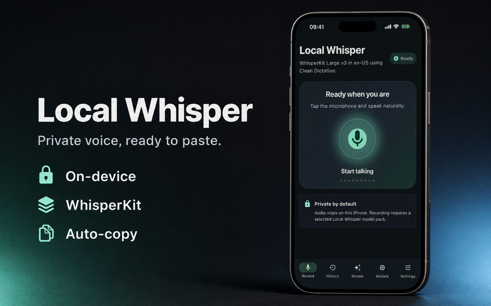
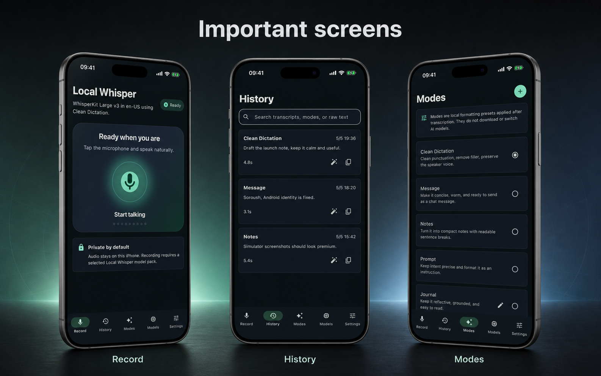
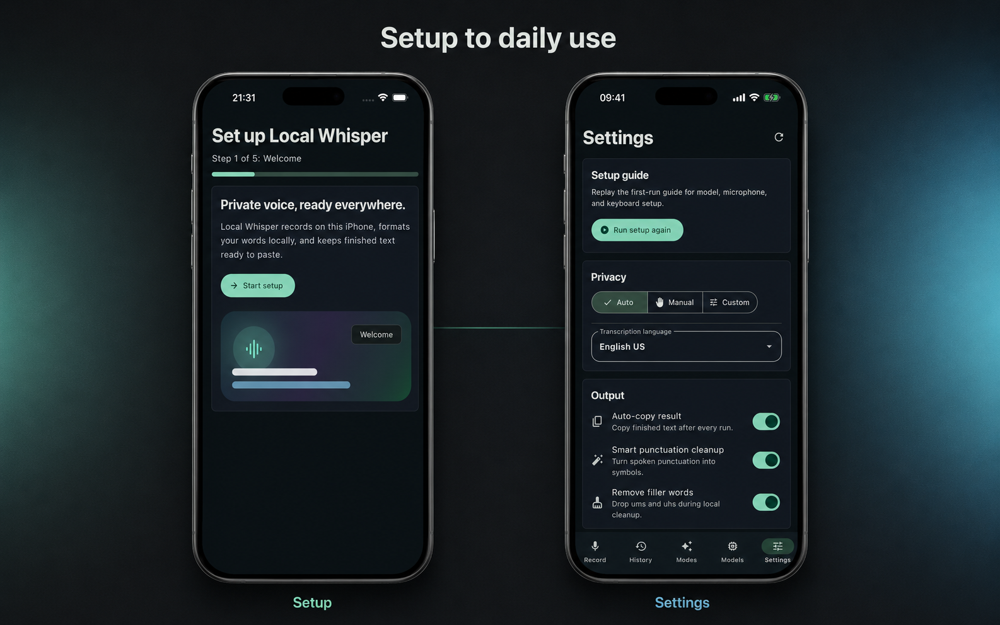

# Mobile Apps

The Flutter mobile app lives in `src/flutter/local_whisper`. Mobile is the app plus the keyboard.

Record in the app, keep local model packs and searchable history on the device, and use modes to shape the finished text. The native keyboard on iOS and the native input method on Android bring Local Whisper actions into other text fields.

iOS transcribes locally today with WhisperKit/Core ML. Android records local WAV audio and transcribes on-device through `sherpa_onnx`. Parakeet-TDT v3 INT8 ONNX is the recommended Android pack; Qwen3-ASR 0.6B INT8 ONNX is the broader multilingual pack.

<p align="center">
  
</p>

<p align="center">
  
</p>

## Status

| Surface | Status | Notes |
|---------|--------|-------|
| iOS app + keyboard | Native transcription wired | Record and transcribe locally with `AVAudioEngine` plus WhisperKit/Core ML. The keyboard extension gives text fields Local Whisper modes, punctuation, haptics, and setup verification. |
| Android app + keyboard | Native transcription wired | Record local WAV audio, transcribe with sherpa-onnx model packs, and verify the native input method in a real text field. The app keeps history, modes, and local model packs on device. |

## Product Flow

First launch shows setup before the tab shell:

1. Welcome
2. Recommended model install
3. Microphone permission
4. Keyboard setup and practice
5. Finish

The setup can be replayed from Settings. The progress indicator is read-only; users move with explicit actions. Optional model choices open in place instead of sending the user to another tab.

<p align="center">
  
</p>

## Architecture

Flutter owns the app shell, local model-pack management, local history, modes, settings, clipboard output, and deterministic cleanup.

Native iOS uses:

- `ios/Runner/LocalSpeechBridge.swift`: microphone recording plus WhisperKit/Core ML bridge.
- `ios/LocalWhisperKeyboard/`: native keyboard extension with mode buttons, punctuation, haptics, and Verify.

Native Android uses:

- `android/app/src/main/kotlin/info/gabrimatic/localwhisper/MainActivity.kt`: microphone status, 16 kHz mono WAV recording, levels, app settings, input-method settings, keyboard status, keyboard verification, and keyboard preference sync.
- `android/app/src/main/kotlin/info/gabrimatic/localwhisper/LocalWhisperInputMethodService.kt`: Verify, punctuation, space, new-line, settings, and haptics.
- `android/app/src/main/AndroidManifest.xml`: microphone, haptics, app identity, launcher identity, and input-method service.

Flutter owns Android transcription through `lib/src/sherpa_speech_service.dart`. The service runs sherpa-onnx in a background isolate, loads the installed model folder, reads the recorded WAV file, and returns the transcript through the same `NativeSpeechService` result shape used by iOS.

## Model Packs

The model manager installs Local Whisper model families from Hugging Face snapshots and verifies installed files against a local manifest before treating a pack as installed.

WhisperKit Large v3 is wired for iOS transcription today. Android uses sherpa-onnx model packs. Qwen3-ASR, Parakeet-TDT v3, WhisperKit, and Kokoro are local model families; they are not hosted APIs and they are not sent to a cloud speech service.

| Pack | Approx size | Notes |
|------|-------------|-------|
| Parakeet-TDT v3 INT8 ONNX | 640 MB | Default Android offline ASR pack through sherpa-onnx. |
| Qwen3-ASR 0.6B INT8 ONNX | 940 MB | Android multilingual ASR pack through sherpa-onnx. |
| Qwen3-ASR MLX | 3.8 GB | Desktop/iOS-family offline ASR pack. |
| Parakeet-TDT v3 MLX | 2.3 GB | Desktop/iOS-family offline ASR pack. |
| Kokoro-82M TTS | 371 MB | Local text-to-speech model. |
| WhisperKit Large v3 | 550 MB | Wired iOS Core ML folder. |

## Android Notes

Android debug QA can seed the recommended pack and interaction data:

```bash
flutter run --dart-define=LOCAL_WHISPER_QA_SEED=true
```

Android can request microphone permission, record local WAV audio, show levels, store local data, verify the native input method, and transcribe with the installed sherpa-onnx model pack. Debug QA still seeds interaction state so the app and keyboard flow can be exercised without downloading a large model during every emulator pass.

## Checks

Run from `src/flutter/local_whisper`:

```bash
flutter pub get
flutter analyze
flutter test
flutter build ios --simulator --debug
flutter build apk --debug

# after a WhisperKit pack is installed in the simulator:
flutter test integration_test/native_transcription_test.dart -d <simulator-id> --dart-define=LOCAL_WHISPER_MODEL_PATH=<installed-model-folder>
```
